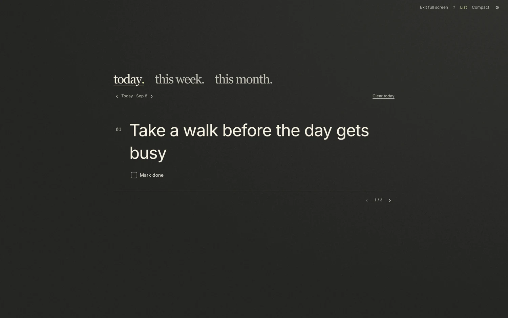

# Three Things

**A little space for what matters.**

Three Things is a small Mac app for choosing three priorities, keeping them in sight, and getting on with your day. There are separate lists for **Today**, **This week**, and **This month**. Three main things in each. No inbox, projects, or streaks to maintain.

## Download for Mac

**[Download Three Things 0.10.0 →](https://github.com/budhennekes/three-things/releases/download/v0.10.0/ThreeThings-0.10.0-mac-arm64.zip)**

Free, open source, and built for **Apple Silicon Macs (M1 or later), macOS 13 or later**. This download does not support Intel Macs, Windows, or Linux.

**Early release:** This build is ad-hoc signed, not signed with an Apple Developer ID or notarized by Apple. macOS may block the first launch. Read the opening instructions below before downloading.

[See the app](https://budhennekes.github.io/three-things/) · [Release notes and checksum](https://github.com/budhennekes/three-things/releases/tag/v0.10.0)



## Why I made it

I wanted a small place to keep the few things I actually meant to do. Not another system to organize, and not a longer list to feel behind on.

So I made Three Things. Choose a few priorities. Keep them close. Give one your attention. When they are done, let that count.

— Bud

## Small on purpose

- **List, Focus, and Compact.** See all three, give one task the screen, or keep a slim three-task bar nearby.
- **Room to focus.** Use the green Mac window button or **Control–Command–F** for native full screen. List stays in a readable column; Focus gives one priority more space. Escape exits.
- **Yesterday and tomorrow, without a calendar.** Use the arrows beside the date to review a previous day or plan ahead. **Back to today** returns you to now. Each date keeps its own tasks and completion status. Tomorrow’s saved plan becomes Today when the date changes.
- **A quiet finish.** Complete your three for a small “Well done.” Add optional tasks with **One more thing** if you want to keep going.
- **A fresh start.** **Clear today** clears only the current day. Undo stays available on that day, even after reopening, until you begin a replacement list.
- **Your choice of background.** Plain colors, quiet photographs, and an illustrated meadow. All bundled locally.
- **Local saving and text export.** No account needed. Use **File → Export Priorities** for a readable copy of your saved days, weeks, months, and extras.

## Install and open

1. Download the ZIP and double-click it to extract **Three Things.app**.
2. Move the app to **Applications**, then open it.
3. If macOS blocks it because the developer cannot be verified, open **System Settings → Privacy & Security**. Find the notice for Three Things and choose **Open Anyway**, then confirm **Open**. Only do this if you trust this download and its source.

[Apple’s instructions for opening apps from outside the App Store](https://support.apple.com/en-us/102445)

Do not disable Gatekeeper or other system-wide protections. If macOS reports malware or says the app will damage your computer, do not bypass that warning. This project has not been reviewed or notarized by Apple.

To update, quit Three Things before replacing the app in Applications. Updates are manual; the app does not download them automatically.

## Privacy and saved work

Priorities stay on your Mac unless you choose to export or share them. The app has no account, cloud sync, task-data upload, or analytics. Backgrounds work offline.

Local does not mean encrypted or backed up. The app stores plain JSON in `~/Library/Application Support/Three Things Local Test/` (a legacy folder name retained to preserve existing users’ data). Back up that folder while the app is closed if you want a restorable copy. Text export is for reading, not importing back into the app.

## Development

Requires Node.js 22+ and macOS.

```sh
npm ci
npm start
npm test
npm run test:ui
npm run test:fullscreen
npm run package:mac
```

UI tests use synthetic, isolated data. `test:fullscreen` changes native macOS Spaces; run it when the desktop is free. The Apple Silicon ZIP is created in `dist/`. Packaging uses an ad-hoc signature and does not notarize the app.

## Credits and license

Code: [MIT](LICENSE). Fonts, icons, photographs, and artwork retain their own terms; see the license files in `assets/`, [photo credits](assets/PHOTO-CREDITS-v5.md), and [photo sources](assets/photo-sources-v6.json).
